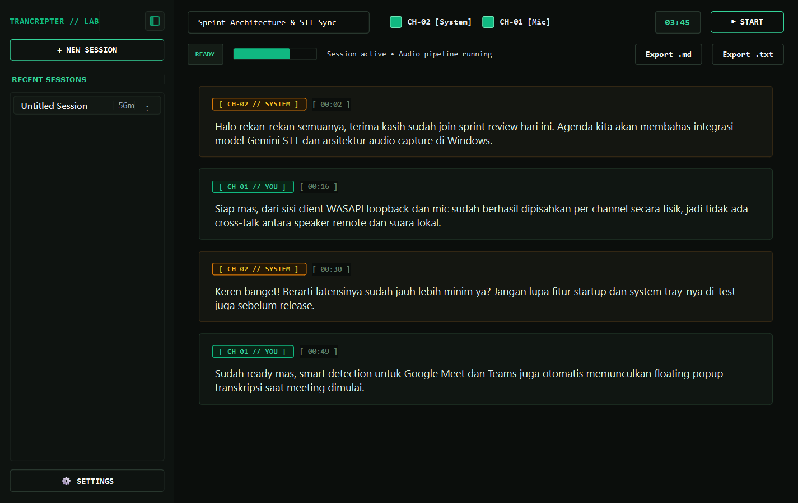

# Transcripter 🎙️

A lightweight, modern Windows desktop application for real-time audio transcription and meeting intelligence. **Transcripter** captures **Windows System Audio (WASAPI Loopback)** and **Microphone** input independently, performs high-fidelity speech recognition via the Google Gemini API with Indonesian, English, and code-switching ("Indoglish") support, merges continuous speaker turns across natural pauses, and offers background meeting auto-detection, system tray controls, and Markdown/TXT export.

<p align="center">
  
</p>

---

## 🌟 Key Features

- **Non-Intrusive Dual-Source Audio Capture**:
  - Works with Google Meet, Zoom, Microsoft Teams, Discord, YouTube, or VLC without requiring plugins, bots, or meeting invites.
  - `System Audio (Loopback)`: Captures remote participants, lectures, and webinars.
  - `Microphone`: Captures your local voice.
  - `Both Simultaneously`: Full two-way conversation transcription.
- **Physical Hardware Channel Separation**:
  - Local Microphone is automatically attributed to **`Speaker 1 (You)`** `[ CH-01 ]`.
  - System Audio Loopback is attributed to **`Speaker 2 (Remote)`** `[ CH-02 ]`.
  - No AI confusion, voice crossover, or incorrect attribution between speakers.
- **Stateful Speaker Turn Aggregation**:
  - Natural pauses do **not** fragment speech into separate cards. Multiple consecutive sentences by the same speaker are automatically aggregated into a cohesive turn block.
- **Bilingual & Code-Switching STT**:
  - Transcribes Indonesian, English, and technical jargon naturally using Google Gemini 2.5 Flash / Flash Lite models.
- **Conservative AI Post-Processing**:
  - Automatically cleans punctuation, sentence capitalization, and obvious typos without summarizing, paraphrasing, or altering spoken words.
- **Smart Meeting Detection & Floating Popup**:
  - Continuously monitors active meeting applications (Google Meet, Microsoft Teams, Zoom, Webex, Discord) via process and window title inspection.
  - Displays a sleek, non-intrusive floating notification in the corner with a 1-click **"Start Transcribe"** action.
- **Windows System Tray & Background Operation**:
  - Runs in the background with a dedicated notification area icon.
  - Context menu for quick recording control (Start/Pause/Resume), settings access, and app visibility.
- **Windows Startup Integration**:
  - Built-in toggle in the Settings dialog to automatically launch Transcripter on Windows startup.
- **Antigravity-Inspired Modern UI**:
  - Clean phosphor terminal theme built with PySide6 (Qt 6).
  - Primary sidebar layout toggle button matching Google Antigravity / VS Code style.
  - Live VU meter, technical telemetry timestamps, and inline click-to-edit transcript cards.
- **Secure Windows Credential Locker (DPAPI)**:
  - Gemini API keys are encrypted in the Windows Credential Manager using your OS login credentials via `keyring`. No plaintext keys are ever saved to disk or repository files.
- **Native Windows Launcher (`Transcripter.exe`)**:
  - Native C# launcher executable with custom emerald icon and `AppUserModelID` for clean Windows Taskbar grouping and Start Menu / Desktop shortcuts.

---

## 🏗️ Architecture Overview

```
┌─────────────────────────────────┐       ┌─────────────────────────────────┐
│     Windows System Audio        │       │       Physical Microphone       │
│       (WASAPI Loopback)         │       │          (Local User)           │
└────────────────┬────────────────┘       └────────────────┬────────────────┘
                 │                                         │
        [Resample to 16kHz]                       [Resample to 16kHz]
                 │                                         │
     [Adaptive VAD Segmenter]                  [Adaptive VAD Segmenter]
     (Pauses >= 1.5s & Min 5s)                 (Pauses >= 1.5s & Min 5s)
                 │                                         │
                 └───────────────────┬─────────────────────┘
                                     │
                    [Google Gemini STT Engine]
                                     │
                    [Conservative AI Post-Processor]
                                     │
                     [Stateful Speaker Turn Manager]
                                     │
            ┌────────────────────────┴────────────────────────┐
            │                                                 │
  [PySide6 Terminal UI]                            [Background Services]
  - Antigravity Sidebar                            - Smart Meeting Detector
  - Inline Card Editor                             - Windows System Tray
  - Markdown & TXT Export                          - Startup Manager (DPAPI)
```

---

## ⌨️ Keyboard Shortcuts

| Shortcut | Action | Description |
| :--- | :--- | :--- |
| **`Ctrl + B`** | **Toggle Sidebar** | Expand or collapse the primary session sidebar (Antigravity layout style) |
| **`Esc`** | **Close Dialog** | Close Settings or floating popups |

---

## 🚀 Getting Started

### Prerequisites
- **Windows 10 or 11 (64-bit)**
- **Python 3.11 or 3.12**
- A free **Google Gemini API Key** (available at [Google AI Studio](https://aistudio.google.com/))

### Installation

1. **Clone the repository**:
   ```powershell
   git clone https://github.com/Asharuu/Transcripter.git
   cd Transcripter
   ```

2. **Create and activate virtual environment**:
   ```powershell
   python -m venv .venv
   .venv\Scripts\activate
   ```

3. **Install dependencies**:
   ```powershell
   pip install -r requirements.txt
   ```

4. **Launch the application**:
   ```powershell
   python src/main.py
   ```

---

## 📦 Native Launcher & Desktop Shortcut

To run Transcripter as a native Windows desktop app with its own taskbar icon and desktop shortcut:

1. **Compile the launcher**:
   ```powershell
   powershell -ExecutionPolicy Bypass -File scripts/build_launcher.ps1
   ```
2. This will:
   - Compile `Launcher.cs` into `Transcripter.exe` with the embedded emerald app icon.
   - Create a desktop shortcut (`Transcripter.lnk`) and Start Menu entry.
   - Configure the Windows `AppUserModelID` (`Asharuu.Transcripter.DesktopApp`) for native taskbar pinning without generic Python logos.

---

## ⚙️ Configuration & API Key Setup

1. Launch Transcripter and click **⚙ Settings** at the bottom of the sidebar.
2. Enter your Gemini API key in the **Gemini API Key** field.
3. Click **Test Connection** to verify your API quota and connectivity.
4. Customize your audio sources, model preference, meeting detection, and startup options.
5. Click **Save Settings**.
6. Your key is stored securely in **Windows Credential Manager (DPAPI)** under the `TranscripterApp` target name.

---

## 🧪 Running Tests

Run the complete automated test suite (credential locker, speaker turn aggregation, adaptive VAD segmentation, and WASAPI capture):

```powershell
.venv\Scripts\python -m unittest discover -s tests -p "test_*.py"
```

To run a hardware diagnostic on your active Windows audio endpoints:
```powershell
.venv\Scripts\python tests/test_live_pipeline.py
```

---

## 🔒 Privacy & Security

- **Zero Permanent Audio Recordings**: Transcripter processes audio chunks in volatile memory and deletes raw buffers immediately after transcription. Only the final text transcript is saved.
- **Zero Committed Secrets**: `.gitignore` strictly protects `.env`, `*.log`, `temp_audio/`, and credential files from entering Git history.
- **Direct Encrypted API Calls**: Audio segments are transmitted directly to Google's official Gemini endpoint via TLS using your own private API key.

---

## 📄 License

This project is licensed under the MIT License — see the [LICENSE](LICENSE) file for details.
